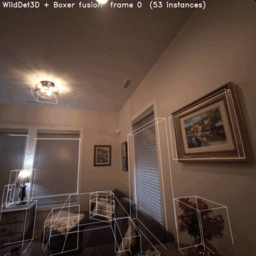
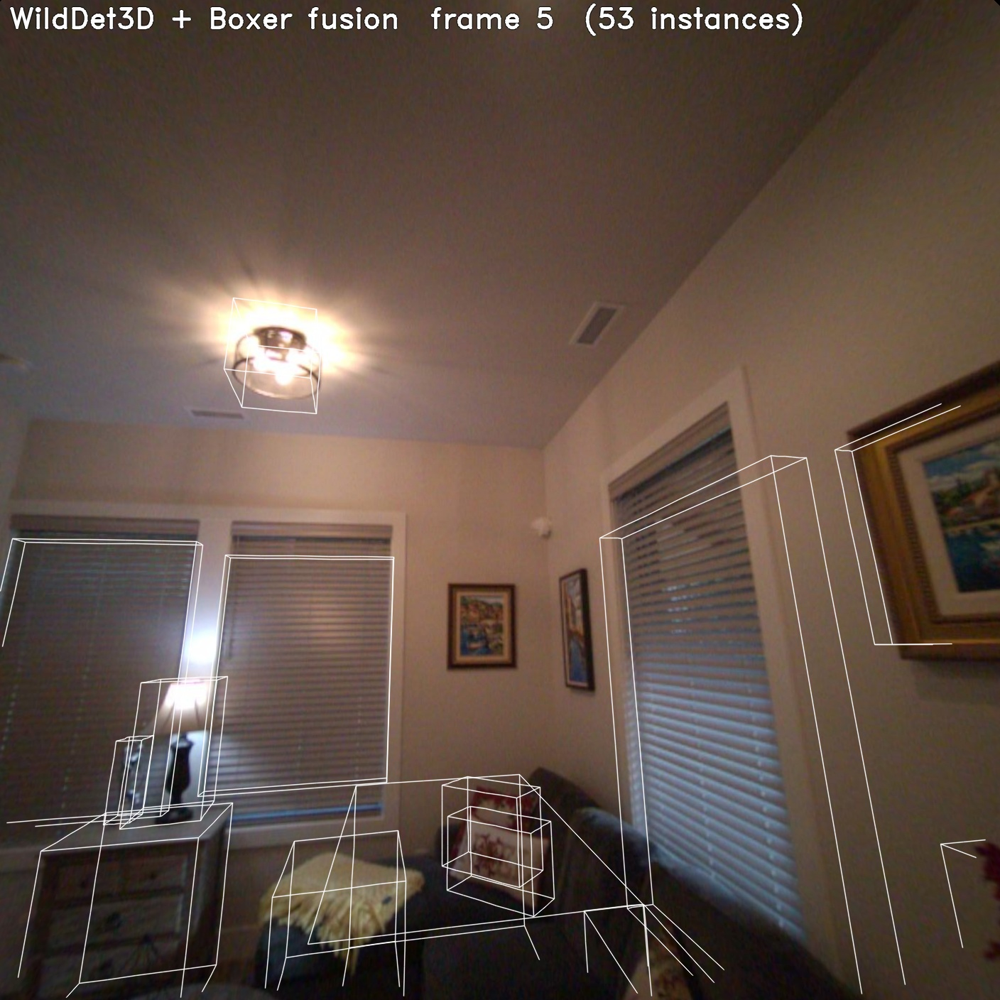
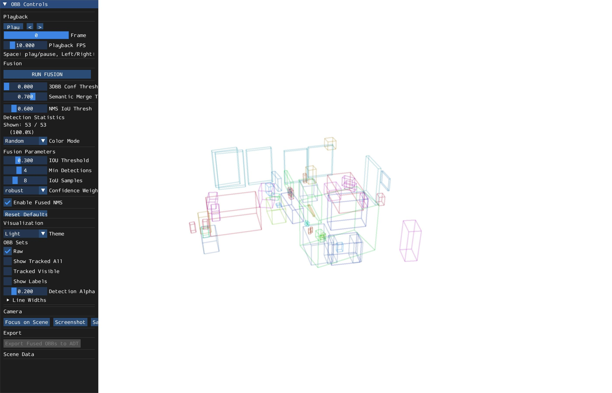

# Integrating with Meta FAIR's Boxer demo for indoor labelling

[Boxer](https://github.com/facebookresearch/boxer) is Meta/FAIR's framework for
2D->3D oriented bounding box lifting on Project Aria devices. Its end-to-end
demo pipeline is OWL-V2 (text-prompted 2D detection) → BoxerNet (per-box 3D
lifting) → CSV → offline fusion / online tracking → 3D viewer.

This demo replaces the **OWL + BoxerNet** detection stages with a single
**WildDet3D** call. Everything else - the AriaLoader, pose math
(`PoseTW` / `ObbTW`), per-frame visualization (`draw_bb3s` / `make_mp4`),
offline fusion (`fuse_obbs_from_csv`), online tracker
(`BoundingBox3DTracker`), and the 3D viewers (`view_fusion.py` /
`view_tracker.py`) - is imported from Boxer **unchanged**. The output CSV
uses Boxer's exact 15-column schema, so Boxer's existing viewers and post-
processing tools work on our outputs without any modification.

<p align="center">
  
</p>

<table>
<tr>
<td align="center"><b>Demo #1 — Per-frame OBB overlay</b></td>
<td align="center"><b>Demo #3 — view_fusion.py (Boxer's 3D viewer, unmodified)</b></td>
</tr>
<tr>
<td align="center"></td>
<td align="center"></td>
</tr>
<tr>
<td align="center">WildDet3D 3D boxes drawn back onto the upright Aria RGB frame via Boxer's <code>draw_bb3s</code>.</td>
<td align="center">Same fused instances rendered in Boxer's interactive 3D viewer — fed our <code>wilddet3d_3dbbs_fused.csv</code> directly, no code changes.</td>
</tr>
</table>

## Pipeline

```
                              Boxer original                                          This demo
        ┌─────────────────────────────────────────────────┐    ┌─────────────────────────────────────────────────┐
        │  AriaLoader (unrotate=True)                     │    │  AriaLoader (unrotate=True)                     │
        │              │                                  │    │              │                                  │
        │              v                                  │    │              v                                  │
        │  OWL-V2 (text-prompted 2D detection)            │    │  WildDet3D (text-prompted, end-to-end 3D)       │
        │              │                                  │    │              │                                  │
        │              v                                  │    │              v                                  │
        │  BoxerNet (per-box 3D lifting)                  │    │  per-frame 3D OBBs                              │
        │              │                                  │    │              │                                  │
        │              v                                  │    │              v                                  │
        │  per-frame 3D OBBs                              │    │  ObbCsvWriter2 → wilddet3d_3dbbs.csv            │
        │              │                                  │    │              │                                  │
        │              v                                  │    │              v                                  │
        │  ObbCsvWriter2 → boxer_3dbbs.csv                │    │  fuse_obbs_from_csv / BoundingBox3DTracker      │
        │              │                                  │    │              │                                  │
        │              v                                  │    │              v                                  │
        │  fuse_obbs_from_csv / BoundingBox3DTracker      │    │  view_fusion.py / view_tracker.py (Boxer GUI)   │
        │              │                                  │    └─────────────────────────────────────────────────┘
        │              v                                  │
        │  view_fusion.py / view_tracker.py (Boxer GUI)   │
        └─────────────────────────────────────────────────┘
```

Only the orange box (the detection stage) changes; the entire IO / fusion /
tracking / viz stack is reused as-is.

## What's WildDet3D / What's Boxer

| Component                                            | Source            |
| ---------------------------------------------------- | ----------------- |
| 2D + 3D detection                                    | **WildDet3D**     |
| `build_model`, `preprocess`                          | **WildDet3D**     |
| Adapter (`wilddet3d_to_obb`, axis convention)        | **This demo**     |
| `AriaLoader` (Aria VRS reader)                       | Boxer             |
| `ObbTW`, `PoseTW`, `CameraTW`                        | Boxer             |
| `ObbCsvWriter2`, `read_obb_csv`                      | Boxer             |
| `draw_bb3s`, `put_text`, `make_mp4`                  | Boxer             |
| `fuse_obbs_from_csv`                                 | Boxer             |
| `BoundingBox3DTracker`                               | Boxer             |
| `view_fusion.py`, `view_tracker.py` (interactive UI) | Boxer             |

## Quick Start

### 1. Clone Boxer next to WildDet3D

```bash
cd WildDet3D
git clone https://github.com/facebookresearch/boxer.git
```

Install Boxer and download its sample Aria sequences per the
[Boxer README](https://github.com/facebookresearch/boxer#sample-data).
Note that Boxer is released under **CC-BY-NC 4.0** (non-commercial); the
WildDet3D code in this demo (`run_wilddet3d.py`, `render_fused.py`, this
README) is under the same Apache 2.0 license as the rest of WildDet3D.

### 2. Run the WildDet3D detection + Boxer fusion

```bash
# Equivalent to Boxer's `python run_boxer.py --input nym10_gen1 --fuse`
python -m demo.boxer.run_wilddet3d \
    --input nym10_gen1 \
    --max_n 90 \
    --fuse \
    --use_depth \
    --ckpt ckpt/wilddet3d_alldata_all_prompt_v1.0.pt \
    --boxer_path boxer
```

The `--use_depth` flag mirrors what Boxer's BoxerNet consumes: Aria's
semi-dense points (SDP) from on-device SLAM, projected to the camera
and rasterized into a sparse `(H, W)` depth map that goes into
WildDet3D's geometry backend as `depth_gt`. Without it, WildDet3D runs
pure monocular (LingBot-Depth predicts depth from the RGB image alone).
The screenshots above are generated with `--use_depth`.

Outputs land under `demo/boxer/output/<sequence>/`:

```
demo/boxer/output/nym10_gen1/
├── wilddet3d_3dbbs.csv         # raw per-frame OBBs (Boxer schema)
├── wilddet3d_3dbbs_fused.csv   # fused static instances (Boxer schema)
├── viz_frames/                 # per-frame jpg with OBB overlays
└── wilddet3d_viz_final.mp4     # assembled video
```

### 3. Render the fused result back onto the video

```bash
python -m demo.boxer.render_fused \
    --input nym10_gen1 \
    --boxer_path boxer
```

This re-loads the AriaLoader, draws the (static) fused instances onto each
frame, and writes them under `demo/boxer/output/<sequence>/viz_frames_fused/`.

### 4. Visualize in Boxer's 3D viewer (unmodified Boxer code)

Because the CSVs follow Boxer's exact schema, Boxer's GUI viewers work
without any change:

```bash
cd boxer

# Demo #3 - offline 3D fusion viewer:
python view_fusion.py --input nym10_gen1 \
    --output_dir ../demo/boxer/output --write_name wilddet3d

# Demo #4 - online 3D tracker viewer:
python view_tracker.py --input nym10_gen1 \
    --output_dir ../demo/boxer/output --write_name wilddet3d
```

For Demo #4 you need to run with `--track` instead of `--fuse`:

```bash
python -m demo.boxer.run_wilddet3d --input nym10_gen1 --max_n 90 \
    --track --ckpt ckpt/wilddet3d_alldata_all_prompt_v1.0.pt \
    --boxer_path boxer
```

This writes `wilddet3d_3dbbs_tracked.csv` (persistent instance IDs across
frames) which `view_tracker.py` reads.

## CLI Options

```
--input         Boxer sequence name (e.g., nym10_gen1)
--max_n         Max frames to process (default 90)
--skip_n        Frame stride (default 1)
--ckpt          WildDet3D checkpoint path
--labels        Comma-separated text prompts (default: 20 indoor categories)
--thresh3d      3D score threshold (default 0.5)
--fuse          Run Boxer's offline 3D box fusion on the output CSV
--track         Run Boxer's online tracker (mutually exclusive with --fuse)
--use_depth     Feed Aria SDP (SLAM semi-dense points) as sparse depth
                into WildDet3D's geometry backend. Off by default
                (pure monocular).
--output_dir    Output directory (default: demo/boxer/output/)
--device        Inference device (default: cuda)
--boxer_path    Path to local clone of facebookresearch/boxer
                (or set BOXER_PATH env var)
```

## Key Implementation Notes

The adapter is `wilddet3d_to_obb()` in `run_wilddet3d.py`. Two conventions
have to be aligned between WildDet3D's output and Boxer's `ObbTW`:

- **Pose chain**: WildDet3D returns 3D boxes in the *camera* frame.
  Boxer expects them in the *world* frame. The chain is
  `T_world_camera = T_world_rig @ T_camera_rig.inverse()`, using Boxer's
  `cam.T_camera_rig` (not `T_rig_camera` - that attribute does not exist).
- **Axis convention**: WildDet3D's RoI2Det3D outputs
  `[center(3), dims=(W,L,H)(3), quat_wxyz(4)]`, and the canonical local
  box frame is `x=L, y=H, z=W` (see `coder.py:_normalize_canonical`).
  Boxer's `bb3_object` keeps the vertical axis on `z`, so we rotate
  90 deg around z and write `bb3 = (L=x, W=y, H=z)`. With this mapping
  the quaternion can be used as-is (no extra rotation) and the boxes
  align with walls / paintings / vertical objects correctly.
- **Sparse depth from Aria SDP** (when `--use_depth` is on): `AriaLoader`
  is loaded with `with_sdp=True`, the SDP world-frame points are
  transformed to the camera frame (using the same `T_world_camera`
  chain), projected with `K`, and rasterized into a sparse `(H, W)`
  depth map in meters. The map goes through the same resize +
  center-pad transforms as the RGB and is passed to the model as
  `depth_gt`. `build_model` is called with `use_depth_input_test=True`
  so the geometry backend actually consumes it (otherwise it's
  ignored at inference).

## Citation

If you use this demo, please cite **both** WildDet3D and Boxer.

```bibtex
@article{huang2025wilddet3d,
  title={WildDet3D: Scaling Promptable 3D Detection in the Wild},
  author={Huang, Weikai and Zhang, Jieyu and others},
  year={2025}
}

@misc{boxer2024,
  title={Boxer: 3D Oriented Bounding Box Lifting for Project Aria},
  author={Meta FAIR},
  year={2024},
  url={https://github.com/facebookresearch/boxer}
}
```
